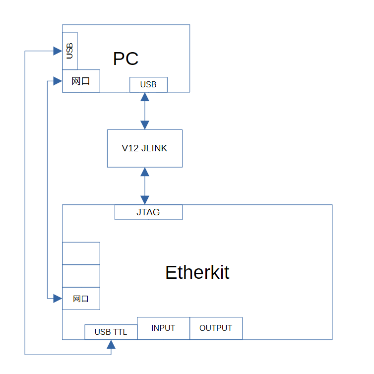
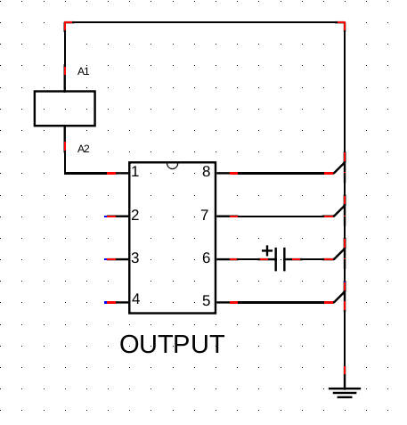
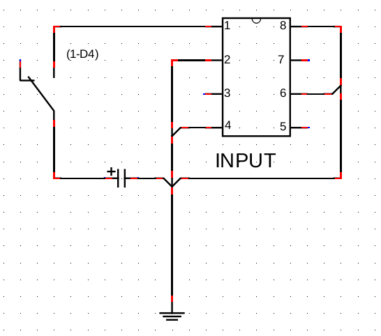
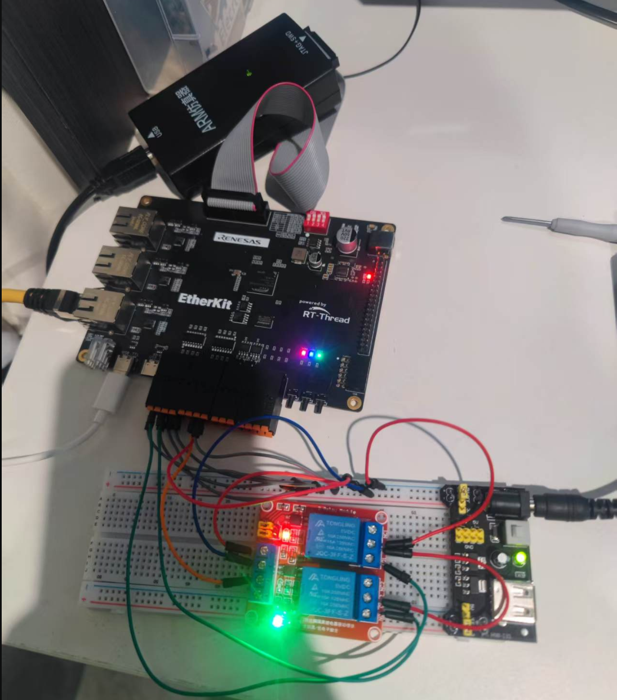
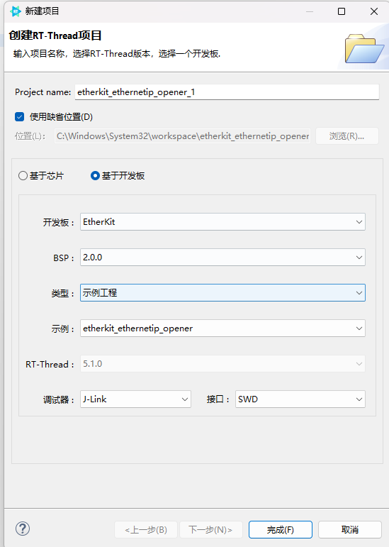
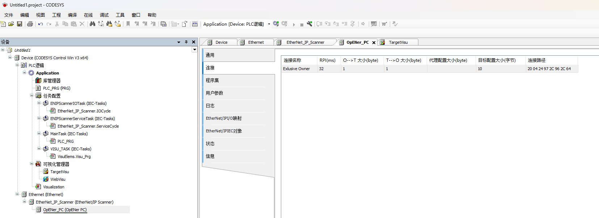
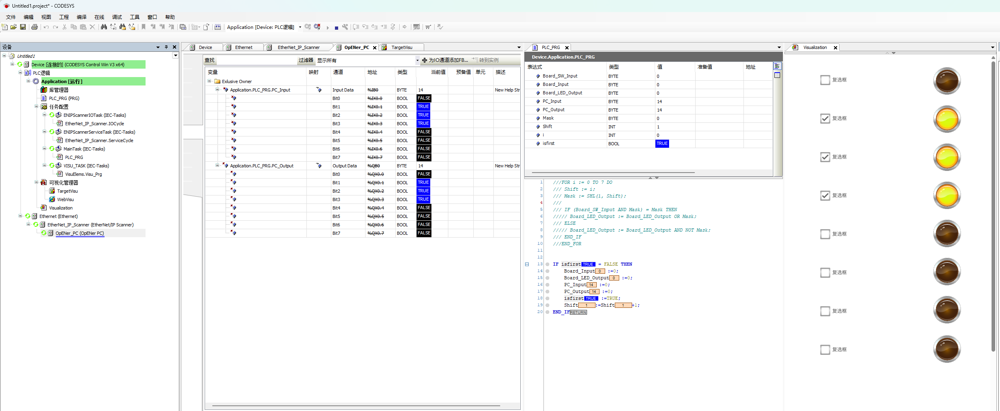

基于Etherkit的工业以太网Ethernet IP远程IO模块


## 应用实现功能

   Etherkit 作为Ethernet/IP远程IO从站实现对继电器的控制以及输入信号的读取。

OpENer 是用于 I/O 适配器设备的 EtherNet/IP™ 堆栈；支持多个 I/O 和显式连接；包括用于制作符合以太网/IP 规范中定义并由 [ODVA](http://www.odva.org/) 发布的 EtherNet/IP™ 兼容产品的对象和服务。


## 前期准备

软件环境：

- [CODESYS](https://us.store.codesys.com/)（Ethernet/IP通信模拟）
- - CODESYS
  - CODESYS Gateway（网关设备）
  - CODESYS Control Win SysTray（软PLC设备）
- [Npcap](https://npcap.com/dist/npcap-1.80.exe)（该软件是运行CODESYS必须的，需要提前安装好！）
 

硬件环境：

- EtherKit开发板


## 硬件架构100


## 输出接线

## 输入接线

## 实物


## RT-Studio 根据开发板创建示例工程


## 修改配置

### IP (.config)

<pre>
```c

CONFIG_RT_LWIP_IPADDR="192.168.0.100"
CONFIG_RT_LWIP_GWADDR="192.168.0.1"
CONFIG_RT_LWIP_MSKADDR="255.255.255.0"

```
</pre>


### 修改GPIO配置(rzngen/pin_data.c)

<pre>
```c

     {
        .pin = BSP_IO_PORT_12_PIN_4,
        .pin_cfg = ((uint32_t) IOPORT_CFG_PORT_DIRECTION_OUTPUT | (uint32_t)   IOPORT_CFG_PORT_OUTPUT_LOW)
    },
    {
        .pin = BSP_IO_PORT_22_PIN_3,
        .pin_cfg = ((uint32_t) IOPORT_CFG_PORT_DIRECTION_OUTPUT | (uint32_t) IOPORT_CFG_PORT_OUTPUT_LOW)
    },
    {
        .pin = BSP_IO_PORT_22_PIN_2,
        .pin_cfg = ((uint32_t) IOPORT_CFG_PORT_DIRECTION_OUTPUT | (uint32_t) IOPORT_CFG_PORT_OUTPUT_LOW)
    },
    {
        .pin = BSP_IO_PORT_17_PIN_4,
        .pin_cfg = ((uint32_t) IOPORT_CFG_PORT_DIRECTION_OUTPUT | (uint32_t) IOPORT_CFG_PORT_OUTPUT_LOW)
    }`


	`{
        .pin = BSP_IO_PORT_04_PIN_1,
        .pin_cfg = ((uint32_t) IOPORT_CFG_PORT_DIRECTION_INPUT)
    },
    {
        .pin = BSP_IO_PORT_16_PIN_7,
        .pin_cfg = ((uint32_t) IOPORT_CFG_PORT_DIRECTION_INPUT)
    },
    {
        .pin = BSP_IO_PORT_17_PIN_3`,
        .pin_cfg = ((uint32_t) IOPORT_CFG_PORT_DIRECTION_INPUT)
    },
    {
        .pin = BSP_IO_PORT_18_PIN_6,
        .pin_cfg = ((uint32_t) IOPORT_CFG_PORT_DIRECTION_INPUT)
    },


```
</pre>

### IO输入输出主程序(src/hal_entry.c)


<pre>
```c
/*
 * Copyright (c) 2006-2024, RT-Thread Development Team
 *
 * SPDX-License-Identifier: Apache-2.0
 *
 * Change Logs:
 * Date           Author        Notes
 * 2025-11-25     starzhuu   first version
 */

#include <rtthread.h>
#include "hal_data.h"
#include <rtdevice.h>
#include <board.h>
#include <opener_api.h>

#define IO_OUTPUT0    BSP_IO_PORT_12_PIN_4
#define IO_OUTPUT1    BSP_IO_PORT_22_PIN_3
#define IO_OUTPUT2    BSP_IO_PORT_22_PIN_2
#define IO_OUTPUT3    BSP_IO_PORT_17_PIN_4

#define IO_INPUT0    BSP_IO_PORT_04_PIN_1
#define IO_INPUT1    BSP_IO_PORT_16_PIN_7
#define IO_INPUT2    BSP_IO_PORT_17_PIN_3
#define IO_INPUT3    BSP_IO_PORT_18_PIN_6

extern uint8_t g_assembly_data064[];
extern uint8_t g_assembly_data096[];


static void input_thread_entry(void *param)
{
    const uint8_t mask = 0x0F;
    while (1)
    {

        uint8_t bits = 0;
        bsp_io_level_t lvl;

        R_IOPORT_PinRead(&g_ioport_ctrl, IO_INPUT0, &lvl);  bits |= (lvl != 0) << 0;
        R_IOPORT_PinRead(&g_ioport_ctrl, IO_INPUT1, &lvl);  bits |= (lvl != 0) << 1;
        R_IOPORT_PinRead(&g_ioport_ctrl, IO_INPUT2, &lvl);  bits |= (lvl != 0) << 2;
        R_IOPORT_PinRead(&g_ioport_ctrl, IO_INPUT3, &lvl);  bits |= (lvl != 0) << 3;

        g_assembly_data064[0] = bits & mask;
        rt_thread_delay(10);
    }
}

static void output_thread_entry(void *param)
{
    bool status =false;
    while (1)
    {
        uint8_t bits = g_assembly_data096[0];   /* 原子读 */

        rt_pin_write(IO_OUTPUT0, (bits >> 0) & 1u);
        rt_pin_write(IO_OUTPUT1, (bits >> 1) & 1u);
        rt_pin_write(IO_OUTPUT2, (bits >> 2) & 1u);
        rt_pin_write(IO_OUTPUT3, (bits >> 3) & 1u);

        rt_thread_delay(10);
    }
}

void hal_entry(void)
{
    rt_kprintf("\nHello RT-Thread!\n");
    rt_kprintf("==================================================\n");
    rt_kprintf("This example project is an Ethernet/IP routine!\n");
    rt_kprintf("==================================================\n");

    rt_thread_t input_thr = rt_thread_create("input_thr",input_thread_entry,RT_NULL,512,10,20);
    rt_thread_t output_thr = rt_thread_create("output_thr",output_thread_entry,RT_NULL,512,10,20);
    if (input_thr != RT_NULL)
        rt_thread_startup(input_thr);
    if (output_thr != RT_NULL)
        rt_thread_startup(output_thr);


    while (1)
    {
        rt_thread_mdelay(1000);

    }
}


```
</pre>


### IO输入输出主程序(packages/OpENer_port-latest/sample_application/sampleapplication.c)


<pre>
```c
/*******************************************************************************
 * Copyright (c) 2012, Rockwell Automation, Inc.
 * All rights reserved.
 *
 ******************************************************************************/

#include <string.h>
#include <stdlib.h>
#include <stdbool.h>

#include "opener_api.h"
#include "appcontype.h"
#include "trace.h"
#include "cipidentity.h"
#include "ciptcpipinterface.h"
#include "cipqos.h"

#include "hal_data.h"
#include <rtthread.h>


/**
 * Definition of the number of assembly object instances.
 */
#define DEMO_APP_INPUT_ASSEMBLY_NUM                100 //0x064
#define DEMO_APP_OUTPUT_ASSEMBLY_NUM               150 //0x096
#define DEMO_APP_CONFIG_ASSEMBLY_NUM               151 //0x097
#define DEMO_APP_HEARTBEAT_INPUT_ONLY_ASSEMBLY_NUM  152 //0x098
#define DEMO_APP_HEARTBEAT_LISTEN_ONLY_ASSEMBLY_NUM 153 //0x099
#define DEMO_APP_EXPLICT_ASSEMBLY_NUM              154 //0x09A

/**
 * Definition of connection object instance IDs
 */
#define DEMO_CONNECTION_LED_EXCLUSIVE_OWNER (0)    /// For input assembly #100 and output assembly #150
#define DEMO_CONNECTION_LED_LISTEN_ONLY     (0)    /// For input assembly #100 and output assembly #237 (heart beat)
#define DEMO_CONNECTION_SW_INPUT_ONLY       (0)    /// For input assembly #101 and output assembly #238 (heart beat)

/* global variables for demo application (4 assembly data fields)  ************/

 EipUint8 g_assembly_data064[1]; /* Input */
 EipUint8 g_assembly_data096[1]; /* Output */
static EipUint8 g_assembly_data097[10]; /* Config */
static EipUint8 g_assembly_data09A[1]; /* Explicit */


/* local functions */

/* global functions called by the stack */
EipStatus ApplicationInitialization(void) {
  /* create 3 assembly object instances*/
  /*INPUT*/
  CreateAssemblyObject( DEMO_APP_INPUT_ASSEMBLY_NUM, g_assembly_data064,sizeof(g_assembly_data064) );

  /*OUTPUT*/
  CreateAssemblyObject( DEMO_APP_OUTPUT_ASSEMBLY_NUM, g_assembly_data096,
                        sizeof(g_assembly_data096) );

  /*CONFIG*/
  CreateAssemblyObject( DEMO_APP_CONFIG_ASSEMBLY_NUM, g_assembly_data097,
                        sizeof(g_assembly_data097) );

  /*Heart-beat output assembly for Input only connections */
  CreateAssemblyObject(DEMO_APP_HEARTBEAT_INPUT_ONLY_ASSEMBLY_NUM, NULL, 0);

  /*Heart-beat output assembly for Listen only connections */
  CreateAssemblyObject(DEMO_APP_HEARTBEAT_LISTEN_ONLY_ASSEMBLY_NUM, NULL, 0);

  /* assembly for explicit messaging */
  CreateAssemblyObject( DEMO_APP_EXPLICT_ASSEMBLY_NUM, g_assembly_data09A,
                        sizeof(g_assembly_data09A) );


  ConfigureExclusiveOwnerConnectionPoint(0, DEMO_APP_OUTPUT_ASSEMBLY_NUM,
                                         DEMO_APP_INPUT_ASSEMBLY_NUM,
                                         DEMO_APP_CONFIG_ASSEMBLY_NUM);
  ConfigureInputOnlyConnectionPoint(0,
                                    DEMO_APP_HEARTBEAT_INPUT_ONLY_ASSEMBLY_NUM,
                                    DEMO_APP_INPUT_ASSEMBLY_NUM,
                                    DEMO_APP_CONFIG_ASSEMBLY_NUM);
  ConfigureListenOnlyConnectionPoint(0,
                                     DEMO_APP_HEARTBEAT_LISTEN_ONLY_ASSEMBLY_NUM,
                                     DEMO_APP_INPUT_ASSEMBLY_NUM,
                                     DEMO_APP_CONFIG_ASSEMBLY_NUM);

  /* For NV data support connect callback functions for each object class with
   *  NV data.
   */
  //InsertGetSetCallback(GetCipClass(kCipQoSClassCode), NvQosSetCallback, kNvDataFunc);
  //InsertGetSetCallback(GetCipClass(kCipTcpIpInterfaceClassCode),NvTcpipSetCallback, kNvDataFunc);

    #if defined(OPENER_ETHLINK_CNTRS_ENABLE) && 0 != OPENER_ETHLINK_CNTRS_ENABLE
      /* For the Ethernet Interface & Media Counters connect a PreGetCallback and
       *  a PostGetCallback.
       * The PreGetCallback is used to fetch the counters from the hardware.
       * The PostGetCallback is utilized by the GetAndClear service to clear
       *  the hardware counters after the current data have been transmitted.
       */
      {
        CipClass *p_eth_link_class = GetCipClass(kCipEthernetLinkClassCode);
        InsertGetSetCallback(p_eth_link_class,
                             EthLnkPreGetCallback,
                             kPreGetFunc);
        InsertGetSetCallback(p_eth_link_class,
                             EthLnkPostGetCallback,
                             kPostGetFunc);
        /* Specify the attributes for which the callback should be executed. */
        for (int idx = 0; idx < OPENER_ETHLINK_INSTANCE_CNT; ++idx)
        {
          CipAttributeStruct *p_eth_link_attr;
          CipInstance *p_eth_link_inst =
            GetCipInstance(p_eth_link_class, idx+1);
          OPENER_ASSERT(p_eth_link_inst);

          /* Interface counters attribute */
          p_eth_link_attr = GetCipAttribute(p_eth_link_inst, 4);
          p_eth_link_attr->attribute_flags |= (kPreGetFunc | kPostGetFunc);
          /* Media counters attribute */
          p_eth_link_attr = GetCipAttribute(p_eth_link_inst, 5);
          p_eth_link_attr->attribute_flags |= (kPreGetFunc | kPostGetFunc);
        }
      }
    #endif

  return kEipStatusOk;
}

void HandleApplication(void) {
  /* check if application needs to trigger an connection */
}

void CheckIoConnectionEvent(unsigned int output_assembly_id,
                            unsigned int input_assembly_id,
                            IoConnectionEvent io_connection_event) {
  /* maintain a correct output state according to the connection state*/

  (void) output_assembly_id; /* suppress compiler warning */
  (void) input_assembly_id; /* suppress compiler warning */
  (void) io_connection_event; /* suppress compiler warning */
}

EipStatus AfterAssemblyDataReceived (CipInstance * instance)
{
    EipStatus status = kEipStatusOk;

    /*handle the data received e.g., update outputs of the device */
    switch (instance->instance_number)
    {
    case DEMO_APP_OUTPUT_ASSEMBLY_NUM:
         /* Data for the output assembly has been received.
          * Mirror it to the inputs */
       // memcpy( &g_assembly_data064[0], &g_assembly_data096[0],sizeof(g_assembly_data064) );
         break;
       case DEMO_APP_EXPLICT_ASSEMBLY_NUM:
         /* do something interesting with the new data from
          * the explicit set-data-attribute message */
         break;
       case DEMO_APP_CONFIG_ASSEMBLY_NUM:
         /* Add here code to handle configuration data and check if it is ok
          * The demo application does not handle config data.
          * However in order to pass the test we accept any data given.
          * EIP_ERROR
          */
         status = kEipStatusOk;
         break;
       default:
         OPENER_TRACE_INFO(
           "Unknown assembly instance ind AfterAssemblyDataReceived");
         break;

    }

    /** Return success code. */
    return kEipStatusOk;
}

EipBool8 BeforeAssemblyDataSend (CipInstance * pa_pstInstance)
{
    EipBool8 has_changed = true;
    //g_assembly_data064[0] = g_assembly_data096[0];
    //if(g_assembly_data064[0]>254) g_assembly_data064[0]=0;
    //g_assembly_data064[0]=g_assembly_data064[0]+1;
    /** Check instance number */
    switch( pa_pstInstance->instance_number )
    {
        case DEMO_APP_EXPLICT_ASSEMBLY_NUM:


      ////  memcpy( &g_assembly_data064[0], &g_assembly_data096[0],sizeof(g_assembly_data064) );
        /* do something interesting with the existing data
            * for the explicit get-data-attribute message */
        break;
        case DEMO_APP_OUTPUT_ASSEMBLY_NUM:

       // g_assembly_data096[0] = 255;
          ////  memcpy( &g_assembly_data064[0], &g_assembly_data096[0],sizeof(g_assembly_data064) );
            /* do something interesting with the existing data
                * for the explicit get-data-attribute message */
            break;

    default:
        break;
    }

    return has_changed;
}

EipStatus ResetDevice (void)
{
    /** Close All connections */
    CloseAllConnections();

    /** Enable Object parameters which should be enabled when Reset Service is required. */
    CipQosUpdateUsedSetQosValues(); ///< QoS DSCP values (#2 ~ #8) of QoS object instance.

    /** Reset Applications */


    /** Return success code */
    return kEipStatusOk;
}

EipStatus ResetDeviceToInitialConfiguration (void)
{
    /** Reset encapsulation inactivity timeout (#13) of TCP/IP interface object instance to default value. */
    g_tcpip.encapsulation_inactivity_timeout = 120;
    CipQosResetAttributesToDefaultValues();
    /** Perform Type 0: Reset */
    ResetDevice();

    /** Return success code */
    return kEipStatusOk;
}

void*
CipCalloc(size_t number_of_elements,
          size_t size_of_element) {
  return calloc(number_of_elements, size_of_element);
}

void CipFree(void *data) {
  free(data);
}

void RunIdleChanged(EipUint32 run_idle_value) 
{
  OPENER_TRACE_INFO("Run/Idle handler triggered\n");
  if ((0x0001 & run_idle_value) == 1) 
  {
    CipIdentitySetExtendedDeviceStatus(kAtLeastOneIoConnectionInRunMode);
  } 
  else 
  {
    CipIdentitySetExtendedDeviceStatus(kAtLeastOneIoConnectionEstablishedAllInIdleMode);
  }
  (void) run_idle_value;
}
```
</pre>


### PLC 配置与程序



<!-- 备注 -->


**源码**：https://github.com/ll-z/etherkit_ethernetip_opener.git


**批注**：opener.c中启动OpENer应用INIT_APP_EXPORT(netdev_monitor_init);。